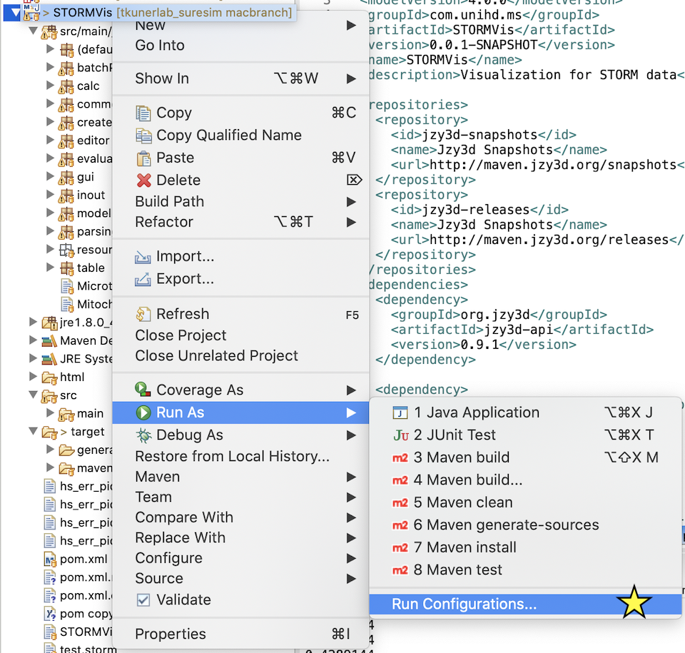
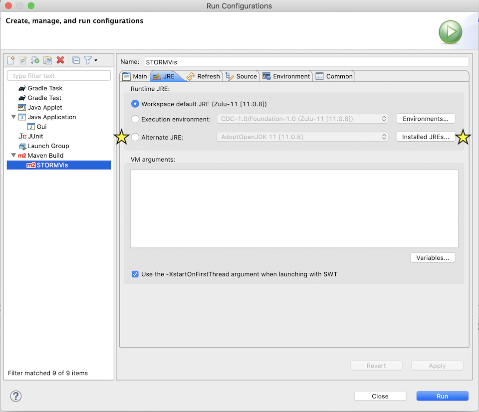
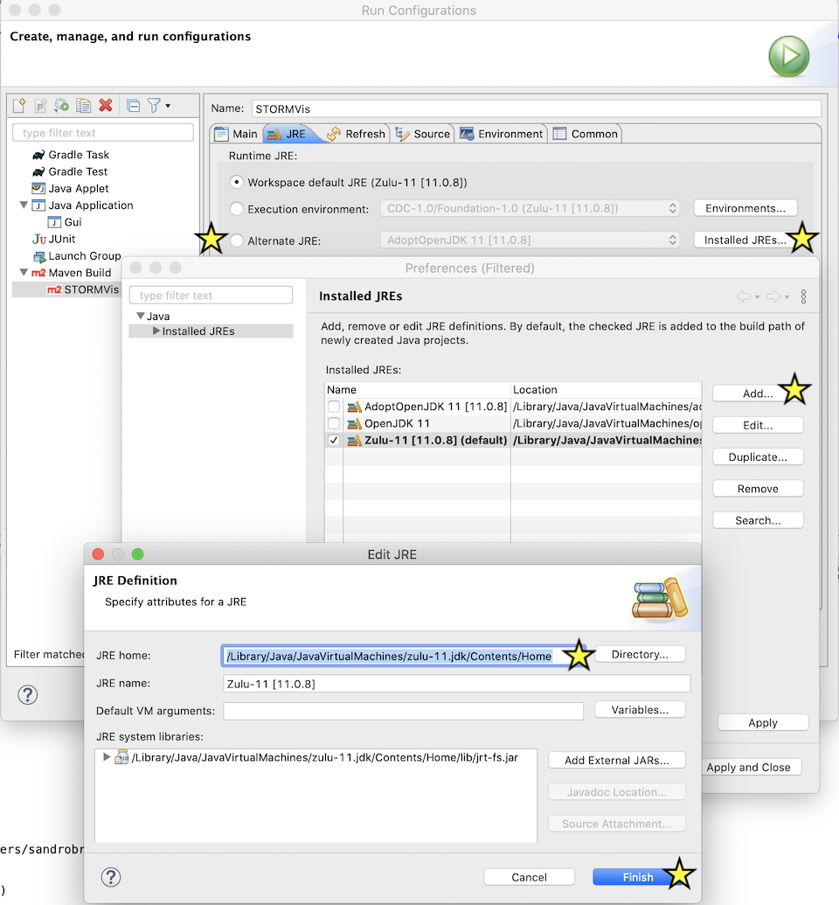
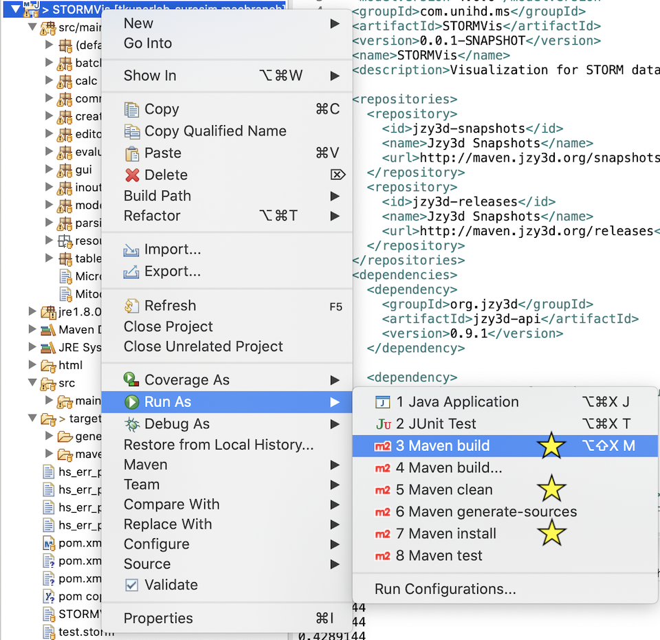
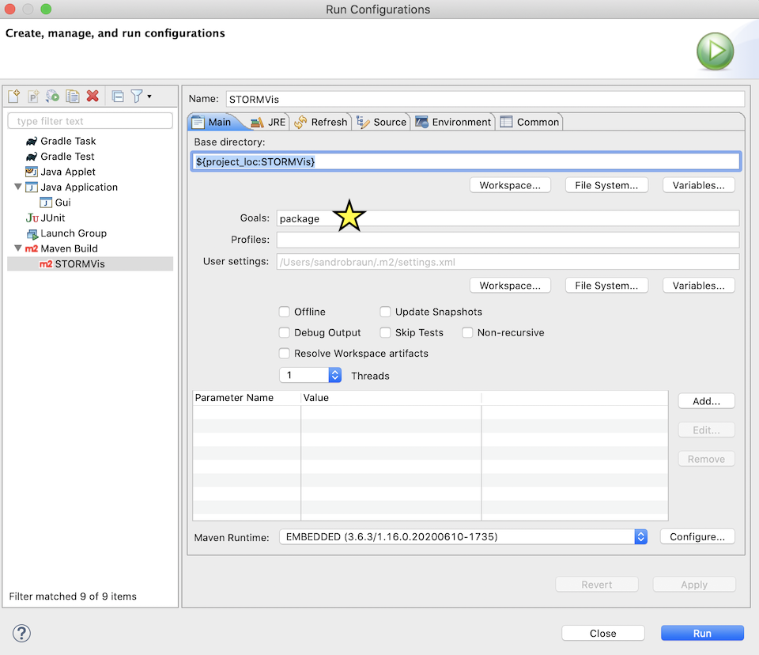

# Add new Java version to Eclipse Project

1. Rightclick the project root, --> `Run AS` --> `Run Configurations`

2. Under `Maven Build` --> `JRE` --> `Check Alternate JRE`--> `Installed JREs`

3. `Add` --> `JRE home` paste java home path obtained from `/usr/libexec/java_home -V`

4. Build with maven. First run `Maven clean`, then `Maven install` and then `Maven build`. Note: If eclipse complains that a compile goal has to be specified, one has to `Maven build ...` and enter `package` under `goals`.

5. Run GUI

